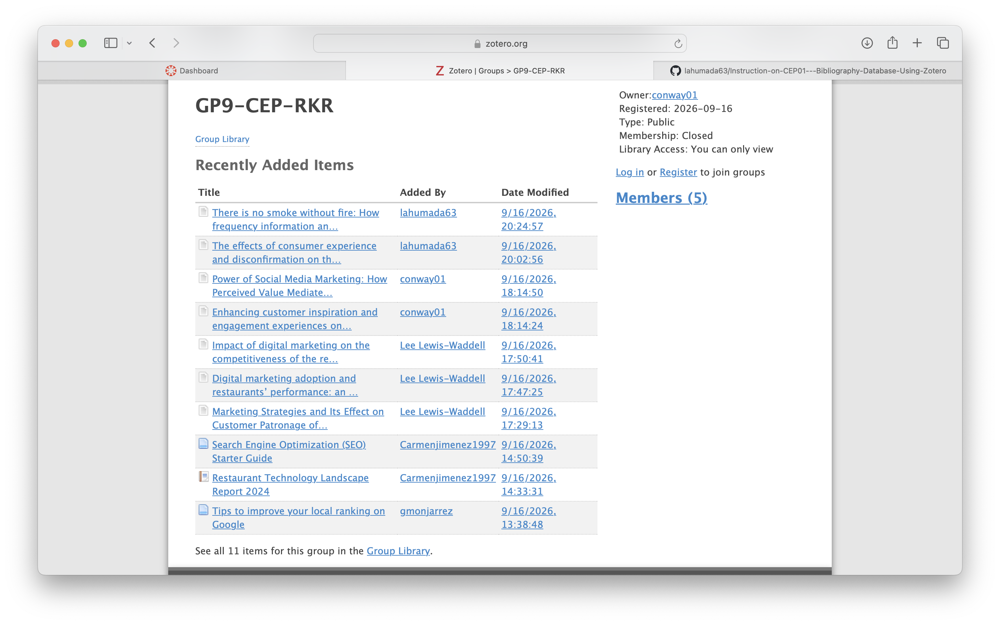

# Bibliography Database Using Zotero

## Zotero Group Library Screenshot

{#fig-zotero-group width="100%"}

## Example Zotero Item Screenshot

## Group Source Summary Table

-   [Word Document Linked Here](https://livecsupomona-my.sharepoint.com/:w:/g/personal/lewiswaddell_cpp_edu/IQCHEzBjq6--R6XzLUoaq6HzASi6K-_Wn9Mu20jVyHv5hy4?e=bho0PZ)

## Zotero Group Library Link or Invitation Information

# Appendix

-   GitHub Repository

-   GitHub Pages
