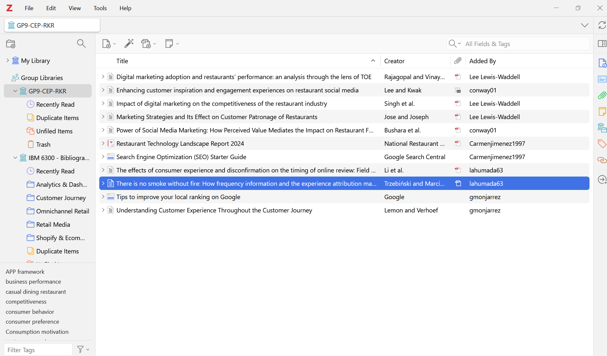
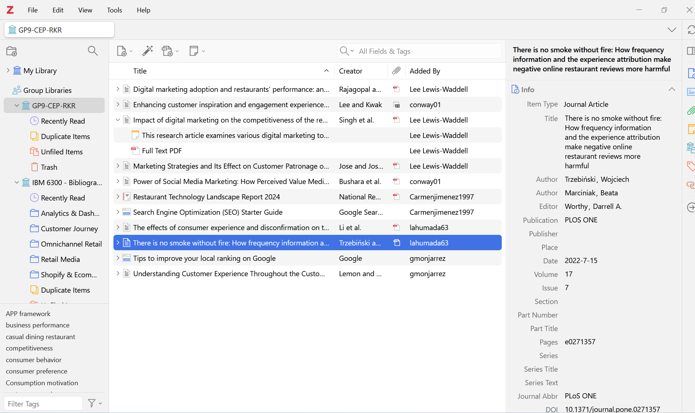
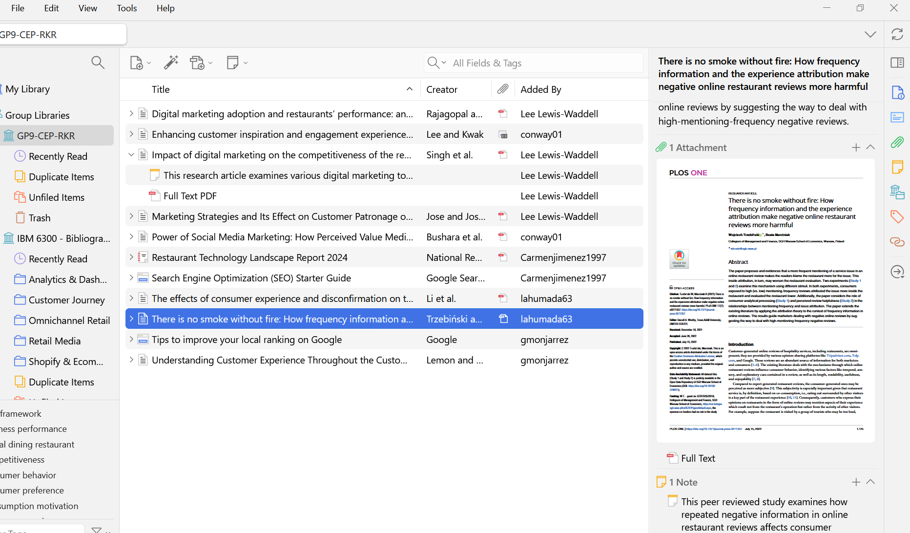
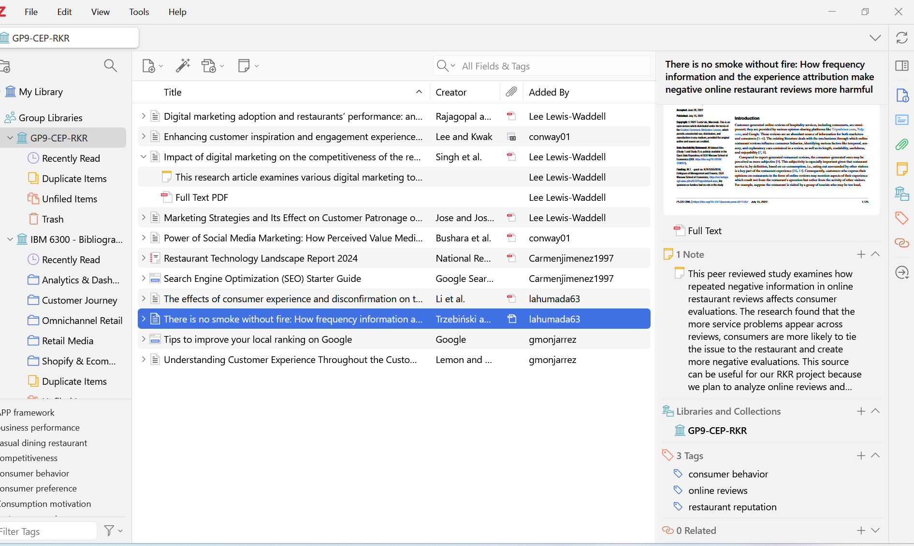

# Bibliography Database Using Zotero

## Zotero Group Library Screenshot

{width="714"}

## Example Zotero Item Screenshot

## Group Source Summary Table

-   [Word Document Linked Here](https://livecsupomona-my.sharepoint.com/:w:/g/personal/lewiswaddell_cpp_edu/IQCHEzBjq6--R6XzLUoaq6HzASi6K-_Wn9Mu20jVyHv5hy4?e=bho0PZ)

## Zotero Group Library Link or Invitation Information

<https://www.zotero.org/groups/6674816/gp9-cep-rkr/library>

# Appendix

- [GitHub Repository](https://github.com/lahumada63/Instruction-on-CEP01---Bibliography-Database-Using-Zotero.git)

- GitHub Pages
